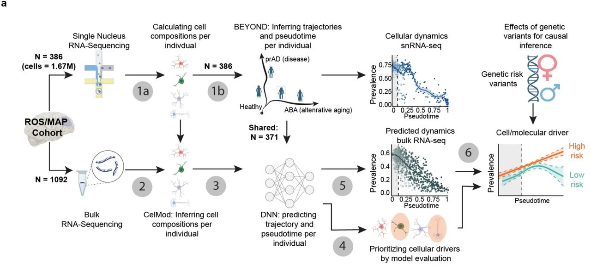

# DeepDynamics

DeepDynamics is a deep-learning framework that combines a small reference
single-cell or single-nucleus RNA-seq atlas with large bulk RNA-seq cohorts to
infer cell-type-specific and clinicopathological dynamics along annotated
trajectories.

The framework was developed to study processes such as disease progression and
aging, where bulk RNA-seq provides cohort-level statistical power but does not
directly retain cell-type resolution. DeepDynamics transfers trajectory
information learned from the single-cell reference to bulk cohorts and supports
downstream benchmarking, power analysis, scaling analysis, and interpretation.

In the [accompanying study](https://www.biorxiv.org/content/10.64898/2025.12.15.694345v1.full),
DeepDynamics was applied to 1,092 cortical bulk aging-brain profiles to
investigate cellular, pathological, and molecular mediators of Alzheimer's
disease.

[](https://www.biorxiv.org/content/10.64898/2025.12.15.694345v1.full)

*Figure 1a. Overview of the DeepDynamics framework.*

## Repository structure

```text
DeepDynamics/
├── DeepDynamics/
│   ├── DeepDynamics_example.ipynb   # End-to-end guided tutorial
│   ├── deepdynamics.yml             # Python/ML Conda environment (dd)
│   ├── deepdynamics-r.yml           # R analysis Conda environment (dd_r)
│   ├── prediction/                  # Model, loss, data structures, and training code
│   ├── explainability/              # Model-explainability notebook
│   ├── benchmarking/                # Baseline comparisons and DTW analyses
│   ├── power_analysis/              # Cohort and incremental-sampling power analyses
│   └── scaling_laws/                # Training-cohort-size scaling analysis
├── DeepDynamics_analyses/
│   ├── scripts/                     # Figure and validation analysis scripts
│   └── src/
│       ├── utils/                   # Shared R analysis utilities
│       └── visualization/           # Figure-generation functions
└── README.md
```

The main components are:

- `prediction/`: PyTorch implementation of DeepDynamics, including the model,
  loss function, dataset wrapper, preprocessing, and training utilities.
- `benchmarking/`: comparisons with linear regression, Elastic Net, XGBoost,
  and TabPFN, together with correlation, loss, visualization, and dynamic time
  warping utilities. Text files in this directory describe the associated
  methods.
- `power_analysis/`: analytic and simulation-based power estimates for group
  effects along the prAD and ABA trajectories.
- `scaling_laws/`: analysis of predictive performance as a function of bulk
  training-cohort size.
- `DeepDynamics_analyses/`: R scripts used for the paper-level downstream
  analyses and figure generation.

## Installation

### Prerequisites

- Git
- Conda or Mamba
- Linux is recommended because the supplied environments reproduce the Linux
  environments used for the analyses.
- A CUDA-capable GPU is optional. CPU execution is supported but model fitting
  and repeated benchmarking will be slower.
- R is required only for the analyses under `DeepDynamics_analyses/` and for
  R-based trajectory-dynamics workflows.

### Clone the repository

```bash
git clone https://github.com/naomihabiblab/DeepDynamics.git
cd DeepDynamics
```

### Create the Python/ML environment (`dd`)

The main environment contains the Python 3.11, PyTorch, Scanpy, benchmarking,
power-analysis, and scaling-analysis stack used in this work.

```bash
conda env create --file DeepDynamics/deepdynamics.yml
conda activate dd
```

The file records the CUDA 11.8 PyTorch wheels used in the original `dd`
environment. A compatible NVIDIA driver is required for this build. On a CPU
machine, create the environment without the three CUDA-specific PyTorch wheel
entries and then install the CPU build described in the
[PyTorch installation guide](https://pytorch.org/get-started/locally/).

JupyterLab can be installed in `dd` if it is not already available from the
host system:

```bash
python -m pip install jupyterlab
```

### Create the R environment (`dd_r`)

The R-based dynamics and paper-analysis workflow was run in a separate
environment:

```bash
conda env create --file DeepDynamics/deepdynamics-r.yml
conda activate dd_r
```

The environments are intentionally separate. `dd` uses Python 3.11 and the
PyTorch ML stack, whereas `dd_r` uses R 4.5 and includes Python 3.14 as a
dependency of the pandas/Matplotlib tools used there. Combining these package
sets makes dependency resolution less reliable. Use `dd` for model training,
benchmarking, notebooks, power analysis, and scaling analysis; use `dd_r` for
R scripts and R-based trajectory-dynamics steps.

### Additional paper-analysis R packages

The `DeepDynamics_analyses/` utilities also reference the following CRAN and
Bioconductor packages. If a script reports a missing package after activating
`dd_r`, install the remaining paper-specific dependencies from R:

```r
install.packages(c(
  "anndata", "boot", "circlize", "colorspace", "cowplot", "dendsort",
  "dplyr", "ggnewscale", "ggplot2", "ggrepel", "gridExtra", "mgcv",
  "pheatmap", "progress", "purrr", "RColorBrewer", "reshape2",
  "reticulate", "stringr", "tidyr", "tidyverse"
))

if (!requireNamespace("BiocManager", quietly = TRUE)) {
  install.packages("BiocManager")
}
BiocManager::install(c(
  "biomaRt", "ComplexHeatmap", "EnhancedVolcano", "SummarizedExperiment"
))
```

## Input data

Study-level participant data are **not** distributed in this repository. Do not
commit participant-level or otherwise restricted data.

A **synthetic tutorial cohort** is included under
`DeepDynamics/prediction/data/synthetic/` so the guided notebook can be run
without access to the study data. Donor identifiers and all numeric values in
that directory are simulated. See
`DeepDynamics/prediction/data/synthetic/README.md` for details.

```text
DeepDynamics/prediction/data/synthetic/
├── README.md                      # Synthetic-data notice
├── 500.h5ad                       # Synthetic AnnData object
├── shared_bulk_data_0.005.csv     # Filtered bulk features for the tutorial
├── shared_bulk_target_0.005.csv   # Branch probabilities and pseudotime
├── shared_bulk_data_mask.csv      # Same features under preprocess naming
├── y.csv                          # Same targets under preprocess naming
├── features_names.csv             # Retained cell-state names
└── X.npy                          # Synthetic single-cell matrix after filtering
```

Authorized study data, when available locally, remain outside this repository
under `DeepDynamics/prediction/data/` and are not required for the synthetic
tutorial path.

Power analysis uses a separate metadata table supplied with `--metadata`. The
required columns are documented in `DeepDynamics/power_analysis/config.py`.

## Getting started

Run commands from the repository root unless noted otherwise.

### Guided notebook

```bash
conda activate dd
jupyter lab DeepDynamics/DeepDynamics_example.ipynb
```

The notebook walks through loading the reference atlas and bulk-derived cell
state proportions, preparing trajectory targets, training DeepDynamics, and
inspecting predictions. The notebook is committed without saved outputs.

### Explainability notebook

```bash
conda activate dd
jupyter lab DeepDynamics/explainability/Model_Explainability_analysis.ipynb
```

Update the input paths in the notebook for the local, authorized dataset before
running it.

### Power analysis

```bash
conda activate dd
cd DeepDynamics
python -m power_analysis.power_analysis \
  --metadata /path/to/metadata.csv
```

Use `python -m power_analysis.power_analysis --help` to list the simulation,
bootstrap, significance-level, and sampling-fraction options.

### Scaling analysis

After placing the feature and target tables under `prediction/data/`:

```bash
conda activate dd
cd DeepDynamics
python scaling_laws/scaling_laws.py
```

## Cite us

If you use DeepDynamics, please cite the accompanying preprint. Yifat Haddad
and Yuval Rom contributed equally to this work.

```bibtex
@article{haddad2025deepdynamics,
  title   = {DeepDynamics resolves cell-subtype and clinicopathological dynamics from bulk RNA-seq to identify mediators of Alzheimer's disease risk},
  author  = {Haddad, Yifat and Rom, Yuval and Green, Gilad Sahar and Cain, Anael and Raveh, Barak and Habib, Naomi},
  journal = {bioRxiv},
  year    = {2025},
  doi     = {10.64898/2025.12.15.694345},
  url     = {https://www.biorxiv.org/content/10.64898/2025.12.15.694345v1.full},
  note    = {Yifat Haddad and Yuval Rom contributed equally to this work}
}
```

## Generated files

Analysis scripts may create `data/`, `outputs/`, `figures/`, model-weight, and
notebook-output artifacts. These files should remain local unless they are
explicitly approved for public release. In particular, notebooks should be
cleared before they are committed.
